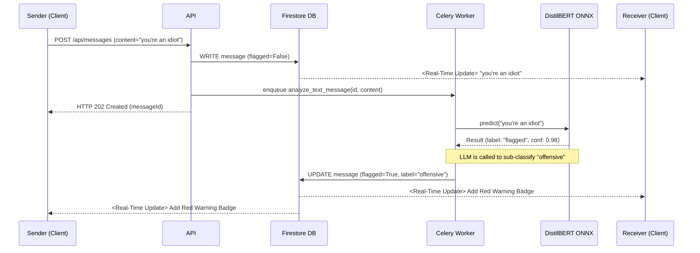
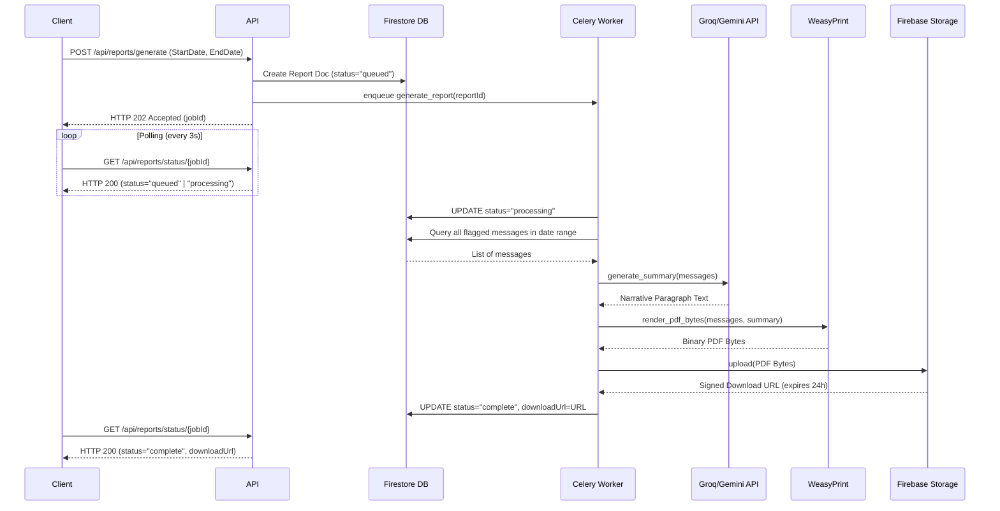

# SafeSpeak — Backend Architecture Guide

This document provides a deep dive into the architecture, execution flow, components, and design decisions of the SafeSpeak FastAPI backend.

---

## 1. High-Level Backend Architecture

The SafeSpeak backend is designed for high performance and zero-message-loss real-time communication. To achieve this while natively supporting heavy Machine Learning inference, the architecture uses out-of-band asynchronous processing for ML tasks while keeping the core API synchronous (for reads/writes) and fast.

```mermaid
graph TD
    Client[Client (React UI)] -- HTTP / HTTPS --> API[FastAPI Server]
    API -- Read/Write --> Firestore[Cloud Firestore]
    API -- Enqueue Task --> Redis[Redis Broker]
    API -- Upload Image --> Storage[Firebase Storage]
    
    subgraph Background Workers [Celery Workers]
        Redis -- Consume Task --> Celery[Task Queue]
        Celery -- Text Inference --> DistilBERT[DistilBERT ONNX Model]
        Celery -- LLM Generation --> GroqGemini[Groq / Gemini APIs]
        Celery -- PDF Generation --> WeasyPrint[WeasyPrint PDF Gen]
        DistilBERT -- Update Result --> Firestore
        GroqGemini -- Update Result --> Firestore
        WeasyPrint -- Store PDF --> Storage
        Storage -- Sign URL --> Firestore
    end
```

### Key Architectural Decisions
1. **No Backend WebSockets:** Firestore's native client-side real-time listeners (`onSnapshot`) are used for chat syncing. The backend only acts as a REST API for *sending* messages, triggering ML workflows, and auth/profile management. This makes the backend completely stateless and infinitely horizontally scalable.
2. **Offloaded ML Inference:** Running Transformer models (like DistilBERT) in HTTP request cycles blocks the event loop and leads to timeouts. All ML inference is offloaded to Celery background workers.
3. **ONNX Runtime (CPU Optimization):** The DistilBERT model was exported from PyTorch `.safetensors` to ONNX format. It runs using the `onnxruntime` CPU provider. Because the app targets Render's free tier (no GPUs), ONNX CPU optimization is critical to achieve sub-100ms inference times.
4. **Single-Container Deployment:** For cost efficiency (Render free tier), `start.sh` runs both the FastAPI process and the Celery worker process inside the *same* Docker container using bash backgrounding (`&`). The worker uses `--pool=solo` to avoid memory fragmentation.

---

## 2. Component Overview

The backend follows a standard controller-service-worker pattern:

### 2.1 Core Infrastructure (`app/core/`)

*   **`config.py`**: Uses `pydantic-settings` to load and validate all environment variables with sensible defaults.
*   **`firebase.py`**: Initializes the Firebase Admin SDK using a service account. It exposes singleton initializers for the Firestore client (`get_firestore_client`) and Firebase Storage bucket (`get_storage_bucket`).
*   **`security.py`**: Provides a FastAPI dependency (`verify_firebase_token`). It hooks into FastAPI's `HTTPBearer` scheme. On every protected request, it extracts the JWT token, verifies it locally against Firebase Auth public keys via the Admin SDK, and returns the user's `uid`.

### 2.2 Routers (Controllers) (`app/routers/`)

*   **`auth.py`**: Handles user profile syncing (called after client-side Firebase login), heartbeat pings (updates `lastSeen`), user search, and starting/deleting conversations.
*   **`messages.py`**: Handles sending text and image messages. 
    *   For text: Writes to Firestore immediately, returns a successful response to the user, and fires off an async task to Celery for text analysis.
    *   For images: Validates size/MIME type, uploads to Firebase Storage (`images/pending/`), writes to Firestore (marked `imageBlurred: true` by default), and fires off an async checking task.
*   **`chatbot.py`**: Implements a 3-step pipeline for screenshot analysis:
    1.  Receives an image, passes it to the OCR service to extract text.
    2.  Passes the extracted text to the DistilBERT model.
    3.  Passes the classification and text to the LLM service to generate a human-friendly response.
    It also maintains an in-memory session history dictionary (`_sessions`) to allow follow-up questions.
*   **`reports.py`**: Enqueues an SOS report generation background layout and provides an endpoint for the frontend to poll the job's status.

### 2.3 Services (Business Logic) (`app/services/`)

*   **`inference.py`**: A Singleton wrapper around `onnxruntime`. On first boot, if the `.onnx` file is missing, it automatically exports it from `.safetensors`. Exposes a `predict(text)` function that handles preprocessing (URL removing, lowecasing) and tokenization, returning `label` and `confidence`.
*   **`llm.py`**: Implements a robust 3-tier LLM fallback chain logic (`call_groq_with_fallback`):
    1.  Try Groq API (Llama 3.3 70B) — preferred, extremely fast.
    2.  Fallback to Google Gemini 1.5 Flash API.
    3.  If both fail/timeout, fallback to a hardcoded string formatting template (ensuring SOS reports still generate even an LLM outage).
*   **`ocr.py`**: A wrapper around `pytesseract`. It uses OpenCV to preprocess screenshots (grayscale → Gaussian blur to denoise → Otsu's thresholding) to significantly improve text extraction accuracy from screen grabs.
*   **`pdf.py`**: An HTML rendering engine using `weasyprint`. It maps over fetched Firestore messages, applies CSS colors dynamically based on the ML classification label, and generates the physical binary PDF bytes for SOS reports.

### 2.4 Celery Workers (`app/workers/`)

*   **`celery_app.py`**: Configures Celery to point to the Redis instance defined in the environment.
*   **`tasks.py`**: Contains the actual async jobs:
    *   `analyze_text_message`: Runs DistilBERT inference. If the message is flagged (Confidence > 0.85), it makes a secondary call to the LLM (`llm.classify_flagged_message`) to sub-classify into `hate_speech`, `threat`, or `offensive`. It then updates the `flagDetails` nested map on the Firestore document.
    *   `analyze_image_safety`: A placeholder for future CNN implementation (currently just auto-clears the blur).
    *   `generate_report`: The heaviest task. Fetches all flagged messages in a date range for a specific conversation -> Uses the LLM to write a narrative summary paragraph -> Calls `pdf.py` to render the PDF -> Uploads to Firebase Storage -> Generates a 24-hr signed download URL -> Updates the Report document status to `complete`.

---

## 3. Data Flow Diagrams

### 3.1 Text Messaging & Real-Time ML Flags

This flow demonstrates how user typing feels instant, but the AI classifications "pop in" dynamically.



### 3.2 SOS Abuse Report Generation

This flow demonstrates a long-running, multi-step job.



---

## 4. Security Philosophy

1.  **Authentication**: All identity is verified using Firebase Auth tokens sent via the `Authorization: Bearer` header. The backend never handles passwords directly.
2.  **Zero-Trust Authorization**: In every router endpoint (especially `auth.py` and `messages.py`), the backend manually checks the target `conversationId` against Firestore. It ensures that the authenticated `uid` exists within the `participants` array of that conversation document before allowing a read, write, update, or delete.
3.  **Database Protection**: Firestore Security Rules (`firestore.rules`) act as a secondary fallback layer, explicitly denying standard users from writing to the `/reports` path or manually updating the ML `flagDetails` via direct SDK access.
4.  **Data Deletion**: Soft deletes (`deleted=True`) are used for flagged messages so that users cannot simply "unsend" abusive messages to hide them from the victim's SOS reports. Clean messages are hard deleted.

---

## 5. Deployment Setup

SafeSpeak's backend uses a dual-Docker approach.

*   **`Dockerfile` (Local Dev)**: Leverages `docker-compose.yml`. Mounts the host's `/ml_models` folder to avoid duplicating the 300MB ML model file. Starts the FastAPI server and Celery worker as two cleanly separated containers routing through a Redis container.
*   **`Dockerfile.render` (Production)**: Due to Render's free tier offering only one service instance, the application uses an amalgamation pattern. It bakes the ML model directly into the image layer, and entrypoint is `start.sh`. `start.sh` spins up the Celery worker in the background (using `--pool=solo`) and then `exec`s the `uvicorn` FastAPI process over the parent shell, effectively running both API and Background Worker in a single 512MB memory space.

Both use an aggressive layer-caching strategy: `requirements-docker.txt` splits out the heavy ML libraries (`torch`, `onnxruntime`, `transformers`) into a separate install step so code changes don't force a 5-minute rebuild of the ML stack.
