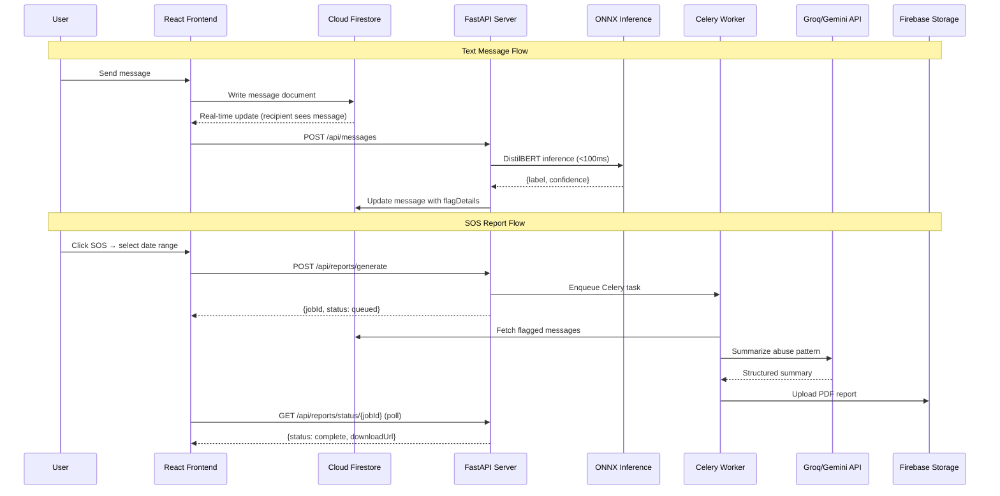
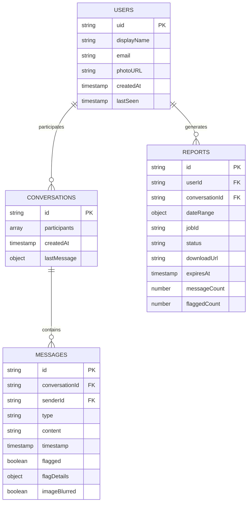

# SafeSpeak v2.0 — Design Document

**Version:** 1.0  
**Status:** Draft  
**Last Updated:** February 23, 2026  
**Derived From:** [PRD.md](file:///e:/Safe%20Speak/safe-speak-version2/PRD.md) · [TECH_STACK.md](file:///e:/Safe%20Speak/safe-speak-version2/TECH_STACK.md) · [front_end_skill.md](file:///e:/Safe%20Speak/safe-speak-version2/front_end_skill.md) · [testing_skill.md](file:///e:/Safe%20Speak/safe-speak-version2/testing_skill.md) · [theme_skill.md](file:///e:/Safe%20Speak/safe-speak-version2/theme_skill.md)

---

## Table of Contents

1. [Overview & Vision](#1-overview--vision)
2. [System Architecture](#2-system-architecture)
3. [Frontend Design System](#3-frontend-design-system)
4. [Backend & API Design](#4-backend--api-design)
5. [AI/ML Pipeline Design](#5-aiml-pipeline-design)
6. [Data Architecture](#6-data-architecture)
7. [Authentication & Security Design](#7-authentication--security-design)
8. [Background Processing Design](#8-background-processing-design)
9. [Theming & Visual Identity](#9-theming--visual-identity)
10. [Testing Strategy](#10-testing-strategy)
11. [Deployment Architecture](#11-deployment-architecture)
12. [Cost & Infrastructure Summary](#12-cost--infrastructure-summary)
13. [Implementation Phases](#13-implementation-phases)
14. [Risk Register & Mitigations](#14-risk-register--mitigations)

---

## 1. Overview & Vision

### 1.1 What is SafeSpeak?

SafeSpeak is a **real-time messaging platform** that combines end-to-end secure communication with **proactive AI-driven hate speech detection**. It empowers victims of online abuse by:

- **Automatically flagging** harmful text content in < 100ms using DistilBERT
- **Blurring offensive imagery** via CNN NSFW detection before the recipient sees it
- **Generating formal PDF abuse reports** using LLM summarization (SOS system)
- **Analyzing screenshot evidence** through an OCR + NLP chatbot pipeline

### 1.2 Core AI Pillars

| Pillar | Capability | Target Latency |
|--------|-----------|----------------|
| **Fast** | Sub-100ms DistilBERT inference for real-time text flagging | < 100ms p95 |
| **Reliable** | Background LLM-driven SOS report generation | < 30s for 500 messages |
| **Robust** | OCR + NLP pipeline for screenshot evidence analysis | < 5s per image |

### 1.3 Target Users

| Persona | Role | Primary Need |
|---------|------|-------------|
| **Aisha** (24) | Targeted User | Automated evidence collection without reliving abuse |
| **Marcus** (34) | Community Moderator | Proactive flagging to act before harm is done |
| **Dev** (28) | Bystander/Ally | Analyze and formalize third-party screenshot evidence |

### 1.4 Zero-Cost Constraint

Every service in this design runs at **₹0 / $0** during development and MVP scale (~100 DAU). The first cost threshold is a Render.com upgrade (~$7/month) when DAU exceeds ~500.

---

## 2. System Architecture

### 2.1 High-Level Architecture Diagram

```
┌─────────────────────────────────────────────────────────────────────┐
│  FRONTEND (Firebase Hosting — free)                                  │
│  React 18 · Vite · TypeScript · Tailwind CSS                        │
│  ├─ Auth Module       → Firebase Auth SDK                            │
│  ├─ Chat UI           → Firestore real-time listeners                │
│  ├─ SOS Module        → Polling-based job tracker (react-query)      │
│  └─ Chatbot UI        → File upload + LLM response display          │
├─────────────────────────────────────────────────────────────────────┤
│  BACKEND / API (Render.com — free tier)                              │
│  FastAPI (Python 3.11) · Pydantic v2 · Uvicorn                      │
│  ├─ /auth             → JWT validation middleware                    │
│  ├─ /messages         → Message write + async ML dispatch            │
│  ├─ /reports          → SOS trigger + job status polling             │
│  └─ /chatbot          → OCR + NLP pipeline endpoint                  │
├──────────────────────────┬──────────────────────────────────────────┤
│  AI / ML INFERENCE       │  BACKGROUND WORKERS                      │
│  DistilBERT (ONNX RT)    │  Celery + Redis Cloud (free 30MB)        │
│  EfficientNet-B0 (ONNX)  │  ├─ Report Generator                    │
│  Tesseract 5 OCR         │  ├─ LLM Caller (Groq → Gemini fallback) │
│                          │  └─ PDF Renderer (WeasyPrint)            │
├──────────────────────────┴──────────────────────────────────────────┤
│  DATA LAYER                                                          │
│  Cloud Firestore (free) · Firebase Storage (free) · Redis Cloud      │
├─────────────────────────────────────────────────────────────────────┤
│  MONITORING                                                          │
│  Sentry (free) · self-hosted Grafana · Prometheus                    │
└─────────────────────────────────────────────────────────────────────┘
```

### 2.2 Data Flow Summary



### 2.3 Key Architectural Decisions

| Decision | Choice | Rationale |
|----------|--------|-----------|
| Frontend framework | React 18 SPA (Vite) over Next.js | Real-time data from Firestore listeners, no SSR needed |
| Styling | Tailwind CSS over MUI/Chakra | Full design control, smaller bundle size for real-time app |
| API framework | FastAPI over Flask/Django | Async-native for inference + Firestore + LLM calls; auto OpenAPI docs |
| ML runtime | ONNX Runtime over raw PyTorch | 2–4× faster CPU inference, enables sub-100ms on free tier |
| LLM provider | Groq API over local Ollama | 500 tok/s inference with no GPU; free tier fits MVP budget |
| Task queue | Celery + Redis Cloud | Reliable async processing; Redis free tier (30MB) sufficient |
| Database | Firestore over PostgreSQL | Built-in real-time listeners, offline persistence, free tier |

---

## 3. Frontend Design System

> *Driven by [front_end_skill.md](file:///e:/Safe%20Speak/safe-speak-version2/front_end_skill.md) — create distinctive, production-grade interfaces that avoid generic "AI slop" aesthetics.*

### 3.1 Design Philosophy

SafeSpeak's frontend must convey **trust, safety, and empowerment** while remaining visually striking:

- **Tone:** Refined and reassuring — a premium feel that communicates security without feeling clinical
- **Differentiator:** The contrast between the calm, sophisticated UI and the powerful AI protection working invisibly underneath
- **Typography:** Distinctive display font + refined body font — avoid generic choices (Inter, Roboto, Arial)
- **Color:** Dominant palette with sharp accents; not a timid, evenly-distributed scheme
- **Motion:** Staggered page-load reveals, meaningful micro-interactions on flagged messages, smooth chat transitions

### 3.2 UI Component Architecture

```
src/
├── components/
│   ├── auth/              # Login, Register forms
│   │   ├── LoginForm.tsx
│   │   └── RegisterForm.tsx
│   ├── chat/              # Core messaging UI
│   │   ├── ChatWindow.tsx
│   │   ├── MessageBubble.tsx      # Handles flag indicators (⚠️ badge)
│   │   ├── ImageMessage.tsx       # Blur overlay + reveal flow
│   │   └── ConversationList.tsx
│   ├── sos/               # SOS reporting system
│   │   ├── SOSButton.tsx          # Pinned to chat header
│   │   ├── DateRangePicker.tsx    # Modal with date range selection
│   │   └── ReportStatus.tsx       # Toast + download button
│   └── chatbot/           # OCR + analysis chatbot
│       ├── ChatbotPanel.tsx
│       └── FileUploadZone.tsx     # Drag-and-drop screenshot upload
├── hooks/
│   ├── useAuth.ts         # Firebase auth state management
│   ├── useMessages.ts     # Firestore real-time listener for messages
│   └── useReport.ts       # SOS job polling via react-query
├── services/
│   ├── firebase.ts        # Firebase app initialization
│   ├── api.ts             # Axios instance for FastAPI calls
│   └── storage.ts         # Firebase Storage upload helpers
├── pages/
│   ├── Login.tsx
│   ├── Chat.tsx
│   └── Chatbot.tsx
└── types/
    └── index.ts           # Shared TypeScript interfaces
```

### 3.3 Key Frontend Libraries

| Library | Purpose |
|---------|---------|
| `firebase` (JS SDK) | Firestore real-time listeners, Auth, Storage uploads |
| `react-router-dom` v6 | Client-side routing |
| `react-query` (TanStack) | Server state management, SOS job polling |
| `react-hook-form` | Form handling (auth forms, SOS date picker) |
| `date-fns` | Date formatting and manipulation |
| `axios` | HTTP client for FastAPI calls |

### 3.4 Critical UI Flows

#### Flagged Message Display
1. Message appears immediately in chat (optimistic rendering)
2. DistilBERT processes asynchronously (< 100ms)
3. Firestore real-time listener picks up `flagDetails` update
4. If `confidence > 0.85` → subtle ⚠️ badge appears on message bubble
5. Sender is **not** notified (prevents evasion)

#### Image Safety Flow
1. Sender uploads image → stored in `pending/` prefix
2. CNN inference runs (< 300ms)
3. If safe → moved to `approved/`, displayed normally
4. If flagged → blurred preview with "Tap to reveal (flagged content)" warning
5. Reveal requires deliberate click + confirmation dialog

#### SOS Report Flow
1. User clicks SOS button (pinned to chat header) → modal opens
2. Date range picker (default: last 7 days) → "Generate Report"
3. Modal closes → toast: "Your report is being generated..."
4. Frontend polls `GET /api/reports/status/{jobId}` every 3 seconds
5. On completion → in-app notification with **Download PDF** button

---

## 4. Backend & API Design

### 4.1 API Server Structure

```
app/
├── main.py                    # FastAPI app init, middleware, router registration
├── routers/
│   ├── auth.py                # JWT validation middleware
│   ├── messages.py            # POST /messages, POST /messages/image
│   ├── reports.py             # POST /reports/generate, GET /reports/status/{id}
│   └── chatbot.py             # POST /chatbot/analyze, POST /chatbot/message
├── services/
│   ├── inference.py           # DistilBERT + CNN inference wrappers
│   ├── ocr.py                 # Tesseract OCR pipeline
│   ├── llm.py                 # Groq API client + Gemini fallback
│   └── pdf.py                 # WeasyPrint PDF generation
├── workers/
│   ├── celery_app.py          # Celery + Redis config
│   └── tasks.py               # report_generation_task, image_safety_task
├── models/
│   └── schemas.py             # Pydantic request/response models
└── core/
    ├── config.py              # Settings (env vars)
    ├── firebase.py            # Firebase Admin SDK init
    └── security.py            # JWT verification, rate limit helpers
```

### 4.2 API Endpoints

| Method | Endpoint | Purpose | Response |
|--------|----------|---------|----------|
| `POST` | `/api/messages` | Write text message + trigger async ML | `202` + `messageId` |
| `POST` | `/api/messages/image` | Upload image + trigger CNN safety check | `202` + `messageId` + `storageUrl` |
| `POST` | `/api/reports/generate` | Enqueue background SOS report job | `202` + `jobId` |
| `GET` | `/api/reports/status/{jobId}` | Poll SOS report generation status | `200` + `status` + `downloadUrl` |
| `POST` | `/api/chatbot/analyze` | Upload screenshot → OCR + classification | `200` + `extractedText` + `classification` |
| `POST` | `/api/chatbot/message` | Follow-up text to chatbot | `200` + `response` |
| `GET` | `/health` | Health check for load balancer | `200` |

### 4.3 Middleware & Cross-Cutting Concerns

| Concern | Implementation |
|---------|---------------|
| **JWT Auth** | `firebase_admin.auth.verify_id_token()` on every non-auth endpoint |
| **Rate Limiting** | `slowapi` — 10 req/min (auth), 60 msg/min (messages), 5 reports/hr, 30 req/min (chatbot) |
| **Input Validation** | Pydantic v2 models for all request/response schemas |
| **CORS** | Configured via `CORS_ORIGINS` env var |
| **Error Tracking** | Sentry SDK integration |

---

## 5. AI/ML Pipeline Design

### 5.1 Text Classification — DistilBERT

| Property | Detail |
|----------|--------|
| **Base Model** | `distilbert-base-uncased` (HuggingFace) |
| **Fine-tuning Data** | HatEval 2019 + UC Berkeley Measuring Hate Speech |
| **Runtime** | ONNX Runtime (CPU) — exported from PyTorch |
| **Output Classes** | `clean` · `offensive` · `hate_speech` · `threat` |
| **Latency Target** | < 100ms p95 |
| **Memory** | ~250MB (ONNX quantized) |

**Preprocessing Pipeline:**
```
Input text → Strip URLs → Normalize unicode → Lowercase
→ Tokenize (DistilBertTokenizerFast, max 128 tokens)
→ Truncate/pad → ONNX Runtime inference → {label, confidence}
```

**Evaluation Targets:** Precision > 90% · Recall > 85% · F1 > 87%

### 5.2 Image Safety — CNN NSFW Detector

| Property | Detail |
|----------|--------|
| **Architecture** | EfficientNet-B0 (fine-tuned) |
| **Task** | Binary: `safe` / `unsafe` |
| **Input** | 224 × 224 px, normalized RGB |
| **Runtime** | ONNX Runtime (CPU) |
| **Latency Target** | < 300ms p95 |
| **Memory** | ~20MB (ONNX) |

### 5.3 OCR Engine — Tesseract 5

```
Raw Image → Grayscale → Gaussian blur (denoise)
→ Deskew (Hough transform) → Adaptive threshold (Otsu's)
→ Tesseract LSTM inference → Regex post-processing
→ Cleaned text output
```

**Target:** > 90% CER on standard English screenshots

### 5.4 LLM — Report Generation & Chatbot

**Fallback Chain:**
```
Groq API (Llama 3.3 70B, free: 14,400 req/day)
    → [rate limited or down]
Gemini 1.5 Flash API (free: 1M tokens/day)
    → [both unavailable after 3 retries]
Template-based PDF (structured without LLM summary)
```

**Max tokens:** 2,048 per report summary

### 5.5 Inference Memory Budget (Render 512MB Free Tier)

| Component | Memory |
|-----------|--------|
| DistilBERT ONNX (INT8 quantized) | ~250MB |
| EfficientNet ONNX | ~20MB |
| FastAPI + Python overhead | ~80MB |
| **Total** | **~350MB** |
| **Remaining headroom** | **~162MB** ⚠️ |

> [!WARNING]
> The 512MB Render free tier leaves minimal headroom. ONNX models **must** be INT8 quantized before deployment.

---

## 6. Data Architecture

### 6.1 Firestore Collections



### 6.2 Firebase Storage Structure

```
/images/pending/{userId}/{messageId}     ← Awaiting CNN review
/images/approved/{userId}/{messageId}    ← Cleared for display
/reports/{userId}/{reportId}.pdf         ← Generated abuse reports (24h expiry)
```

### 6.3 Security Rules Philosophy

- Users can only read/write documents where their `uid` matches `userId` or appears in `participants`
- No cross-user data access
- PDFs accessible only via server-generated signed URLs (24h expiry)
- Images in `pending/` accessible only via server-side signed URLs

---

## 7. Authentication & Security Design

### 7.1 Auth Flow

```
User login (Firebase Auth SDK) → Firebase ID Token (JWT, 1hr expiry)
→ Token stored in memory (NOT localStorage) → Sent as Bearer token
→ FastAPI validates via firebase_admin.auth.verify_id_token()
→ Token refreshed silently by Firebase SDK before expiry
```

### 7.2 Security Controls

| Control | Implementation |
|---------|---------------|
| **Password handling** | Delegated to Firebase Auth (bcrypt internally) |
| **Session storage** | JWT in `httpOnly` cookie to prevent XSS |
| **Rate limiting** | Per-endpoint limits (auth: 10/min, messages: 60/min, reports: 5/hr) |
| **Input sanitization** | Pydantic validation + SQL/NoSQL injection pattern stripping |
| **File upload validation** | Server-side MIME type check, max 10MB |
| **Transport security** | TLS 1.3 for all data in transit |
| **Login lockout** | 5 failed attempts → 15-minute lockout |
| **GDPR compliance** | Account + data deletion flow |

---

## 8. Background Processing Design

### 8.1 Celery Task Definitions

| Task | Trigger | Description |
|------|---------|-------------|
| `analyze_text_message` | On Firestore message write | Run DistilBERT, update `flagged` + `flagDetails` |
| `analyze_image_safety` | On image upload | Run CNN, move to `approved/` or keep in `pending/` |
| `generate_report` | SOS button click | Fetch messages → LLM summarize → render PDF → upload |

### 8.2 Retry Policy

```python
@celery_app.task(
    bind=True,
    max_retries=3,
    default_retry_delay=5,  # 5s → 15s → 45s (exponential)
    autoretry_for=(GroqAPIError, ConnectionError)
)
def generate_report(self, report_id: str): ...
```

### 8.3 Infrastructure

- **Broker:** Redis Cloud free tier (30MB)
- **Workers:** Run on same Render instance or locally during development
- **Monitoring:** Celery task failure rate tracked via Prometheus

---

## 9. Theming & Visual Identity

> *Driven by [theme_skill.md](file:///e:/Safe%20Speak/safe-speak-version2/theme_skill.md) — 10 pre-set themes available, plus custom theme generation.*

### 9.1 Recommended Theme Direction

For SafeSpeak's context (safety, trust, empowerment), the recommended themes to evaluate are:

| Theme | Direction | Fit |
|-------|-----------|-----|
| **Ocean Depths** | Professional, calming maritime | ✅ Conveys trust & stability |
| **Arctic Frost** | Cool, crisp, clean | ✅ Conveys clarity & protection |
| **Tech Innovation** | Bold, modern tech | ✅ Conveys cutting-edge AI capability |
| **Midnight Galaxy** | Dramatic, cosmic deep tones | ⚡ Premium dark mode feel |

### 9.2 Design Aesthetic Requirements (from Frontend Skill)

| Aspect | Requirement |
|--------|-------------|
| **Typography** | Distinctive display + refined body font. **Avoid:** Inter, Roboto, Arial, system fonts |
| **Color** | Dominant color with sharp accents. **Avoid:** generic purple gradients on white |
| **Motion** | Staggered page-load reveals, hover states that surprise, scroll-triggered effects |
| **Spatial** | Asymmetry, overlap, grid-breaking elements, generous negative space |
| **Backgrounds** | Gradient meshes, noise textures, layered transparencies, grain overlays |
| **Identity** | Each generation must feel unique — no convergence on common AI patterns |

### 9.3 Theme Application Process

1. Select theme from the 10 pre-set options (or generate custom)
2. Read corresponding theme file from `themes/` directory
3. Apply colors and fonts consistently via CSS variables
4. Ensure proper contrast and readability
5. Maintain visual identity across all pages and components

---

## 10. Testing Strategy

> *Driven by [testing_skill.md](file:///e:/Safe%20Speak/safe-speak-version2/testing_skill.md) — Playwright-based web application testing with server lifecycle management.*

### 10.1 Testing Layers

| Layer | Tool | Scope |
|-------|------|-------|
| **Python Unit Tests** | `pytest` | Services, inference wrappers, OCR pipeline, schemas |
| **React Component Tests** | `Vitest` | UI components, hooks, state management |
| **E2E / Integration Tests** | Playwright (via `testing_skill.md`) | Full user flows across frontend + backend |
| **Load Testing** | `Locust` | 1,000 concurrent users (Phase 4) |
| **Linting** | ESLint + Prettier (frontend), Ruff + Black (backend) | Code quality |

### 10.2 Playwright Testing Approach

**Server Management:** Use `scripts/with_server.py` for automated server lifecycle:

```bash
# Single server (frontend only)
python scripts/with_server.py --server "npm run dev" --port 5173 -- python test_e2e.py

# Multi-server (backend + frontend)
python scripts/with_server.py \
  --server "cd backend && python server.py" --port 3000 \
  --server "cd frontend && npm run dev" --port 5173 \
  -- python test_e2e.py
```

**Testing Pattern:** Reconnaissance-then-action:
1. Navigate + wait for `networkidle`
2. Screenshot or inspect DOM to identify selectors
3. Execute actions with discovered selectors

### 10.3 Key Test Scenarios

| Scenario | Type | Acceptance Criteria |
|----------|------|-------------------|
| User registration & login | E2E | Auth succeeds with email + Google OAuth |
| Send text message | E2E | Message appears in < 200ms |
| Hate speech flagging | Integration | DistilBERT returns label in < 100ms, flag indicator shows |
| Image blur on NSFW | E2E | Blurred preview shown, reveal requires confirmation |
| SOS report generation | E2E | PDF generated in < 30s for 500 messages |
| Chatbot OCR analysis | E2E | Screenshot text extracted with > 90% CER |
| Rate limiting | Integration | 6th auth attempt within 1 min returns 429 |

---

## 11. Deployment Architecture

### 11.1 Hosting Map

| Component | Host | Tier | Cost |
|-----------|------|------|------|
| React frontend | Firebase Hosting | Free (10GB storage, 360MB/day) | ₹0 |
| FastAPI backend | Render.com | Free (512MB RAM, spins down 15min) | ₹0 |
| Celery worker | Render.com (same instance) | Free | ₹0 |
| Firestore | Google Firebase | Spark (50K reads/20K writes/day) | ₹0 |
| Firebase Storage | Google Firebase | Spark (5GB, 1GB/day download) | ₹0 |
| Redis | Redis Cloud | Free (30MB) | ₹0 |
| Auth | Firebase Auth | Free (unlimited users) | ₹0 |

### 11.2 Containerization

```dockerfile
FROM python:3.11-slim
RUN apt-get update && apt-get install -y tesseract-ocr
WORKDIR /app
COPY requirements.txt .
RUN pip install --no-cache-dir -r requirements.txt
COPY . .
CMD ["uvicorn", "app.main:app", "--host", "0.0.0.0", "--port", "8000"]
```

```yaml
# docker-compose.yml (local development)
services:
  api:
    build: .
    ports: ["8000:8000"]
    env_file: .env
    depends_on: [redis]
  worker:
    build: .
    command: celery -A app.workers.celery_app worker --loglevel=info
    env_file: .env
    depends_on: [redis]
  redis:
    image: redis:7-alpine
    ports: ["6379:6379"]
```

### 11.3 Cold Start Mitigation

Render free tier spins down after 15min inactivity (~30s cold start). Mitigation: use a free cron ping service (cron-job.org) to hit `GET /health` every 10 minutes.

---

## 12. Cost & Infrastructure Summary

| Service | Free Tier | Expected MVP Usage | Headroom |
|---------|-----------|-------------------|----------|
| Firestore Reads | 50,000/day | ~15,000/day | ✅ 3× |
| Firestore Writes | 20,000/day | ~5,000/day | ✅ 4× |
| Firebase Storage | 5GB | ~500MB | ✅ 10× |
| Firebase Hosting | 360MB/day | ~50MB/day | ✅ 7× |
| Groq API | 14,400 req/day | ~500/day | ✅ 28× |
| Gemini API | 1M tokens/day | ~100K/day | ✅ 10× |
| Redis Cloud | 30MB | ~2MB | ✅ 15× |
| Sentry | 5,000 errors/month | ~100/month | ✅ 50× |
| Render RAM | 512MB | ~350MB | ⚠️ Tight |

> [!IMPORTANT]
> Total MVP infrastructure cost: **₹0**. First paid upgrade at ~500 DAU: Render $7/month ≈ ₹580/month.

---

## 13. Implementation Phases

### Phase 1 — MVP (Weeks 1–6): Core Messaging + Detection
- Firebase Auth (Email + Google OAuth)
- Real-time text messaging (Firestore)
- DistilBERT inference endpoint (ONNX)
- Async message flagging pipeline
- Basic chat UI with flag indicators

**Exit Criteria:** Team can send messages, receive real-time flags, model achieves >90% precision.

---

### Phase 2 — Safety Layer (Weeks 7–10): Image Safety + SOS
- Image upload + Firebase Storage integration
- CNN NSFW classification endpoint
- Image blur UX with reveal flow
- SOS button + date range picker UI
- Celery + Redis background job infrastructure
- LLM report generation + PDF rendering
- Report status polling + download flow

**Exit Criteria:** End-to-end SOS report generated in <30s. Abusive images are blurred before display.

---

### Phase 3 — Chatbot + OCR (Weeks 11–14): Evidence Analysis
- Chatbot UI component
- Tesseract OCR integration
- OCR + DistilBERT pipeline endpoint
- LLM-backed chatbot conversation flow
- Session management (up to 10 turns)

**Exit Criteria:** OCR achieves >90% CER. Chatbot correctly classifies uploaded screenshots.

---

### Phase 4 — Hardening (Weeks 15–16): Security, Monitoring, Launch
- Firestore Security Rules audit
- Rate limiting on all endpoints
- Sentry integration (error tracking)
- Prometheus + Grafana dashboards
- Load testing (Locust — 1,000 concurrent users)
- GDPR data deletion flow

**Exit Criteria:** All KPIs met under load. Security review passed.

---

## 14. Risk Register & Mitigations

| Risk | Likelihood | Impact | Mitigation |
|------|-----------|--------|------------|
| DistilBERT latency > 100ms on CPU | Medium | High | Benchmark early; ONNX INT8 quantization; async-only fallback |
| Groq free tier rate limit hit | Low | Medium | Cache outputs; queue requests; Gemini fallback |
| OCR accuracy on non-standard fonts | High | Medium | Image preprocessing (deskew, threshold); confidence warning |
| False positives disrupting conversations | Medium | High | Tune threshold; only warn at > 85% confidence |
| Render cold start (~30s) | High | Medium | Cron ping every 10min; upgrade to $7/mo for production |
| Firebase free tier exceeded | Low | Medium | Paginate loads; client-side caching |
| LLM API unavailability | Low | High | 3× retry with backoff; Gemini fallback; template-based PDF |
| Render 512MB RAM exceeded | Medium | High | INT8 quantized ONNX models; monitor memory usage |

---

## Open Questions

1. **Multi-language support:** When to expand beyond English-only DistilBERT?
2. **Push notifications:** Should flagged messages trigger Firebase Cloud Messaging?
3. **Chatbot persistence:** Ephemeral or persistent sessions across browser visits?
4. **Moderation dashboard:** Admin view for reviewing platform-wide flagged messages?
5. **Legal admissibility:** Digital signatures or tamper-evident hashes for PDF reports?
6. **Threshold configuration:** Global vs. per-user/per-conversation confidence thresholds?
7. **Group chats:** Is group messaging in scope? How does flagging work in groups?

---

*This design document is derived from the PRD, Tech Stack, and skill files. It should be kept in sync as design decisions evolve.*
