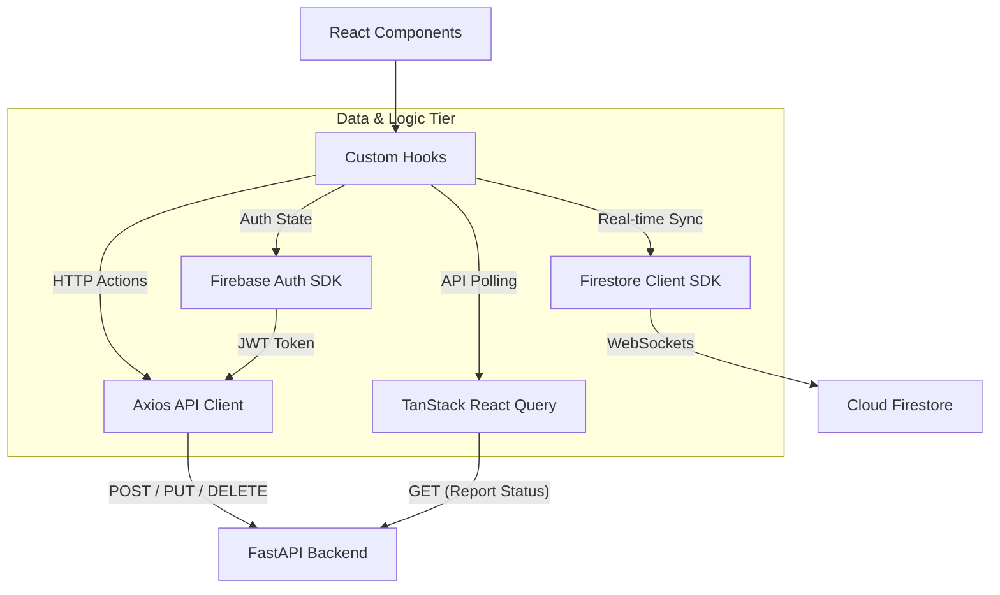

# SafeSpeak — Frontend Architecture Guide

This document provides a deep dive into the architecture, state management, components, and real-time syncing of the SafeSpeak React frontend.

---

## 1. High-Level Frontend Architecture

The SafeSpeak frontend is a Single Page Application (SPA) built with React 18, Vite, and TypeScript. It is designed to be highly responsive and resilient, blending standard REST API calls for actions with real-time Firebase listeners for data synchronization.



### Key Architectural Decisions
1. **Hybrid Data Fetching**: 
   - **Firestore `onSnapshot`**: Used exclusively for fetching messages to provide instant, real-time chat experiences native to modern messaging apps.
   - **Axios REST API**: Used for all *mutations* (sending messages, creating conversations, starting ML tasks). This ensures the backend can intercept the action and dispatch asynchronous Machine Learning tasks before writing the final result to the database.
   - **TanStack React Query**: Used specifically for polling the status of background SOS report generation jobs.
2. **Offline Persistence**: Firestore's IndexedDB offline persistence is enabled. This ensures that users can view their chat history even if they momentarily lose internet connection, preventing data loss.
3. **Tailwind CSS + Glassmorphism**: The UI uses a custom Tailwind configuration with heavy use of backdrop blurs (`backdrop-blur-sm`, `glass-card`), gradients, and CSS variables to create a modern, trusted "safe space" aesthetic.

---

## 2. Directory Structure & Key Files

```
frontend/src/
├── App.tsx                 # Root routing and Context Providers
├── main.tsx                # Vite mount point
├── components/             # Reusable UI pieces
│   ├── auth/               # LoginForm, RegisterForm
│   ├── chat/               # ChatWindow, ConversationList, MessageBubble, ImageMessage
│   ├── chatbot/            # ChatbotPanel, FileUploadZone
│   └── sos/                # SOSButton, DateRangePicker, ReportStatus
├── hooks/                  # Custom React Hooks (Business Logic)
│   ├── useAuth.ts          # Auth state management
│   ├── useMessages.ts      # Real-time Firestore sync listener
│   ├── useReport.ts        # Background job API polling
│   └── useTheme.tsx        # Dark/Light mode toggle + context
├── pages/                  # Route-level components
│   ├── Login.tsx           # /login layout
│   ├── Chat.tsx            # /chat layout (sidebar + main area)
│   └── Chatbot.tsx         # /chatbot layout
├── services/               # External Integrations
│   ├── api.ts              # Axios instance with Interceptors
│   ├── firebase.ts         # Firebase SDK initialization
│   └── storage.ts          # Firebase Storage helpers
└── types/                  # TypeScript interfaces bridging DB and UI
    └── index.ts            # Shared models (Message, User, Report)
```

---

## 3. State Management & Hooks

The application avoids heavy global state libraries (like Redux) in favor of domain-specific custom hooks.

### 3.1 `useAuth`
- **Purpose**: Manages the current user's session.
- **Mechanism**: Attaches an `onAuthStateChanged` listener to Firebase Auth on mount.
- **Flow**: Returns `user` (or null), a `loading` boolean, and methods for login/register/logout. After a successful login, it silently calls `api.post('/api/auth/profile')` to sync the user's latest Auth data (like their Google photo URL) to their Firestore `users` document.

### 3.2 `useMessages`
- **Purpose**: Real-time chat synchronization.
- **Mechanism**: Takes a `conversationId` and sets up a Firestore `onSnapshot` listener on the `conversations/{id}/messages` subcollection, ordered by timestamp.
- **Flow**: Whenever a message is added, deleted, or *when a background ML task updates a message's `flagged` status*, the listener fires, updates the React state, and instantly re-renders the chat window seamlessly.

### 3.3 `useReport`
- **Purpose**: Polls for SOS PDF generation status.
- **Mechanism**: Wraps `useQuery` from `@tanstack/react-query`.
- **Flow**: Once a `jobId` is provided, it hits the `GET /api/reports/status/{jobId}` endpoint. It is configured to automatically refetch every 3000ms until the status returned is either `complete` or `failed`.

---

## 4. Core UI Components

### 4.1 Chat Architecture (`pages/Chat.tsx`)
The main interface is a split-pane layout:
- **`ConversationList` (Sidebar)**: 
  - Queries the `conversations` collection where the current UID is in the `participants` array. 
  - Shows an unread indicator based on whether the current UID is in the `readBy` array of the `lastMessage`.
  - On mobile, it acts as a slide-out drawer controlled by state in `Chat.tsx`.
- **`ChatWindow` (Main Area)**: 
  - Mounts when a conversation is selected. Uses `useMessages` to display the feed.
  - Contains the message input bar, the `SOSButton`, and renders a list of `MessageBubble`s.

### 4.2 Handling ML Output (`components/chat/MessageBubble.tsx`)
The frontend is heavily driven by the asynchronous ML results generated by the backend:
- **Pending State**: Messages immediately render when the user hits send (optimistic UI via Firestore).
- **Flagged State**: If DistilBERT detects hate speech, the Celery worker updates `flagged: true` and writes `flagDetails.label` (e.g., `hate_speech` or `threat`). The UI reacts in real-time by wrapping the bubble in a red/orange glowing border and appending an expandable warning banner citing the classification category.
- **Image Blur (`components/chat/ImageMessage.tsx`)**: Images default to `imageBlurred: true` in the DB when uploaded. The frontend applies a heavy CSS `blur-md` filter to the image. Once the backend worker verifies the image is safe, it updates the DB, and the frontend instantly snaps the image into clarity.

### 4.3 Chatbot Interface (`components/chatbot/ChatbotPanel.tsx`)
Because screenshot analysis takes longer (OCR + DistilBERT + LLM Generation), this component manages complex loading states:
- Uses a `FileUploadZone` drag-and-drop area.
- Tracks `isAnalyzing` state to show a skeleton loader.
- Once the `POST /api/chatbot/analyze` responds, it initializes a chat interface mapping over a local session array combining user follow-up questions and AI answers.

---

## 5. Security & Authentication Integration

- **Firebase Tokens**: The `api.ts` Axios instance uses a request interceptor to call `await auth.currentUser.getIdToken()`. It attaches this to the `Authorization: Bearer` header of *every* outgoing HTTP request, ensuring backend endpoints are perfectly synced with the frontend's login state.
- **Protected Routes**: React Router handles authorization. If `<App />` mounts and `useAuth` returns `loading: false` but `user: null`, the user is immediately redirected to `<Navigate to="/login" replace />`.

---

## 6. Styling System

SafeSpeak uses Tailwind CSS with CSS Variables to support seamless Light/Dark modes:
- Defined in `index.css`: `--color-bg-navy`, `--color-accent-teal`, `--color-flag-red`.
- `tailwind.config.ts` maps these variables to custom utility classes like `bg-navy-900` or `text-flag-rose`.
- **Micro-interactions**: Extensive use of simple animations (e.g., `animate-fade-in-up`, `animate-spin`, `transition-all`) to make the app feel responsive and "alive" during latency-heavy ML operations.
